# ❄️ FrostReflekt ❄️

<div align="center">
  <h3>Freeze the moment. Reflekt the vibe.</h3>
  <p><em>Transform your images with mesmerizing frost and glass effects</em></p>
  
  
  
  
  
</div>

---

## 🌟 Overview

FrostReflekt is a stunning web-based image editor that applies ethereal frost and glass effects to your photos. With its glassmorphism UI and floating particle animations, it creates an immersive winter wonderland experience while providing powerful image manipulation capabilities.

```mermaid
graph TD
    A[🖼️ Upload Image] --> B[🎨 Apply Effects]
    B --> C[❄️ Frost Intensity]
    B --> D[💧 Glass Blur]
    B --> E[✨ Glass Opacity]
    C --> F[🖥️ Real-time Preview]
    D --> F
    E --> F
    F --> G[💾 Download Result]
    
    style A fill:#AFDDE5,stroke:#0FA4AF,stroke-width:3px
    style F fill:#0FA4AF,stroke:#003135,stroke-width:3px
    style G fill:#024950,stroke:#AFDDE5,stroke-width:3px
```



## ✨ Features

### 🎯 Core Functionality
- **Drag & Drop Upload**: Intuitive file handling with visual feedback
- **Real-time Preview**: Instant effect visualization using HTML5 Canvas
- **Frost Effects**: Adjustable blue tinting with radial gradients
- **Glass Effects**: Glassmorphism with customizable blur and opacity
- **Custom Background**: Upload your own background images
- **One-click Download**: High-quality PNG export

### 🎨 Visual Design
- **Glassmorphism UI**: Modern frosted glass interface
- **Floating Particles**: Animated snowflakes and sparkles
- **Responsive Design**: Mobile-first approach
- **Smooth Animations**: CSS transitions and keyframe animations
- **Dynamic Backgrounds**: Gradient overlays with shimmer effects

```mermaid
flowchart LR
    subgraph "🎨 Effect Pipeline"
        A[Original Image] --> B[Blur Filter]
        B --> C[Blue Frost Overlay]
        C --> D[Radial Gradient]
        D --> E[Glass Reflection]
        E --> F[Final Output]
    end
    
    style A fill:#ffffff,stroke:#0FA4AF
    style F fill:#AFDDE5,stroke:#003135,stroke-width:3px
```



## 🏗️ Architecture

The application follows a clean modular architecture:


## 🚀 Quick Start

### Prerequisites
- Modern web browser with Canvas API support
- Local web server (for file uploads)

### Installation

1. **Clone the repository**
   ```bash
   git clone https://github.com/yourusername/frostReflekt.git
   cd frostReflekt
   ```

2. **Start a local server**
   ```bash
   # Using LiveServer [Live server extension to be installed]
   php -S localhost:5500
   ```

3. **Open in browser**
   ```
   http://localhost:5500
   ```

### Usage Flow


## 🎛️ Controls Reference

| Control | Range | Description |
|---------|-------|-------------|
| **❄️ Frost Intensity** | 0-100 | Blue tinting strength |
| **💧 Glass Blur** | 0-20px | Background blur amount |
| **✨ Glass Opacity** | 10-80% | Glass effect transparency |

### Keyboard Shortcuts
- `Escape`: Reset all effects
- `Enter`: Download current image
- `Space`: Upload new image

## 🛠️ Technical Stack


## 📁 File Structure

```
frostReflekt/
├── 📄 index.html          # Main HTML structure
├── 🎨 styles.css          # Glassmorphism styling
├── ⚡ script.js           # Core functionality
├── 🖼️ 22123.jpg          # Default background image
└── 📖 README.md           # This file
```

## 🎨 Effect Processing

The image effects are applied using Canvas composite operations:


## 🌐 Browser Support

| Browser | Version | Support |
|---------|---------|---------|
| Chrome | 60+ | ✅ Full |
| Firefox | 55+ | ✅ Full |
| Safari | 12+ | ✅ Full |
| Edge | 79+ | ✅ Full |

## 🎭 Customization

### Adding New Effects

```javascript
// Example: Add sepia effect
applyCustomEffect() {
    this.ctx.filter = 'sepia(1) hue-rotate(200deg)';
    this.ctx.drawImage(this.originalImage, 0, 0, 
                       this.canvas.width, this.canvas.height);
}
```

### Styling Customization

The CSS uses custom properties for easy theming:

```css
:root {
    --primary-color: #0FA4AF;
    --secondary-color: #AFDDE5;
    --accent-color: #003135;
    --glass-opacity: 0.15;
}
```

## 🤝 Contributing

1. Fork the repository
2. Create a feature branch (`git checkout -b feature/amazing-effect`)
3. Commit changes (`git commit -m 'Add amazing effect'`)
4. Push to branch (`git push origin feature/amazing-effect`)
5. Open a Pull Request

## 📜 License

This project is licensed under the MIT License - see the [LICENSE](LICENSE) file for details.

## 🙏 Acknowledgments

- Inspired by modern glassmorphism design trends
- Canvas API for powerful image manipulation
- CSS animations for smooth user experience

---

<div align="center">
  <p>Made with ❄️ by [SoubhLance](https://github.com/SoubhLance)</p>
  <p><em>Transform your images into winter wonderlands</em></p>
</div>
